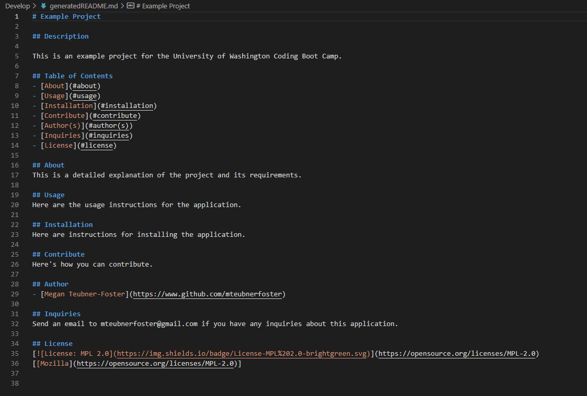
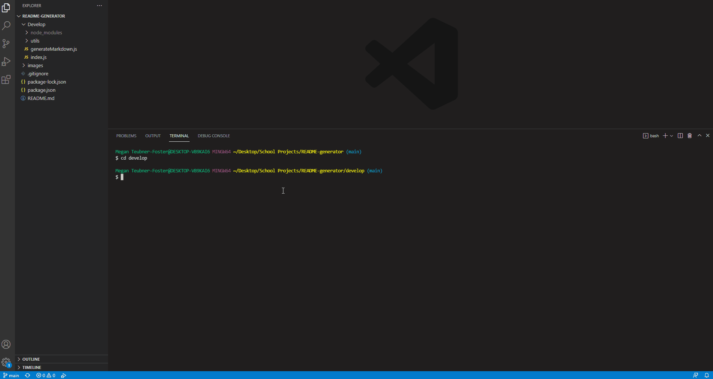

# README Generator

## Description
This command line application generates quality README files. The user will answer questions that will generate a README based on their answers.

## Table of Contents
- [About](#about)
- [Technologies](#technologies)
- [Examples](#examples)
- [Author(s)](#author(s))
- [License](#license)

## About
This is a command line application that accepts user input. When users are prompted for information about their application repositories, a high-quality, professional README file is generated with the information that they enter.

## Technologies
This application was created using:
- [NPM (Inquirer)](https://www.npmjs.com/package/inquirer)
- [JavaScript](https://www.javascript.com/)

## Examples
A photo of the generated README file:  

 
A .gif of the application in action:  

## Author(s)
- [Megan Teubner-Foster](https://www.github.com/mteubnerfoster)

## License

[[MIT](https://opensource.org/licenses/MIT)]

